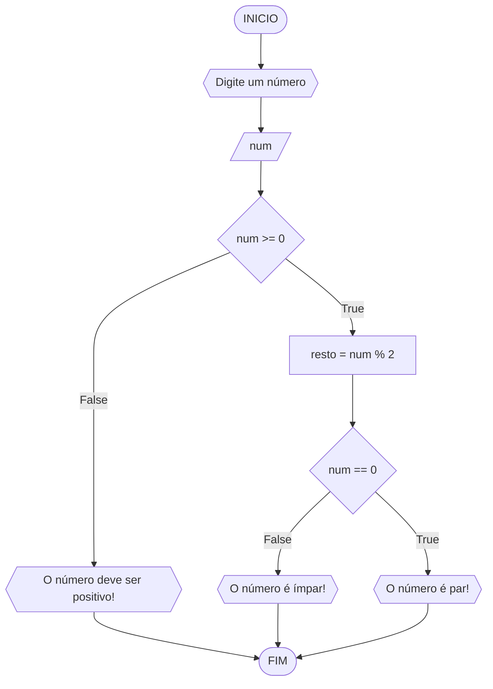

# UNIFOR
**Nome**: Samuel Mesquita Rocha

**Disciplina**: Raciocínio lógico algorítimo

## Lista de exercícios 01

### Exercício 3
Represente, em fluxograma e pseudocódigo, um algorítimo para determinar se um número inteiro e positivo é impar ou par

#### Fluxograma

