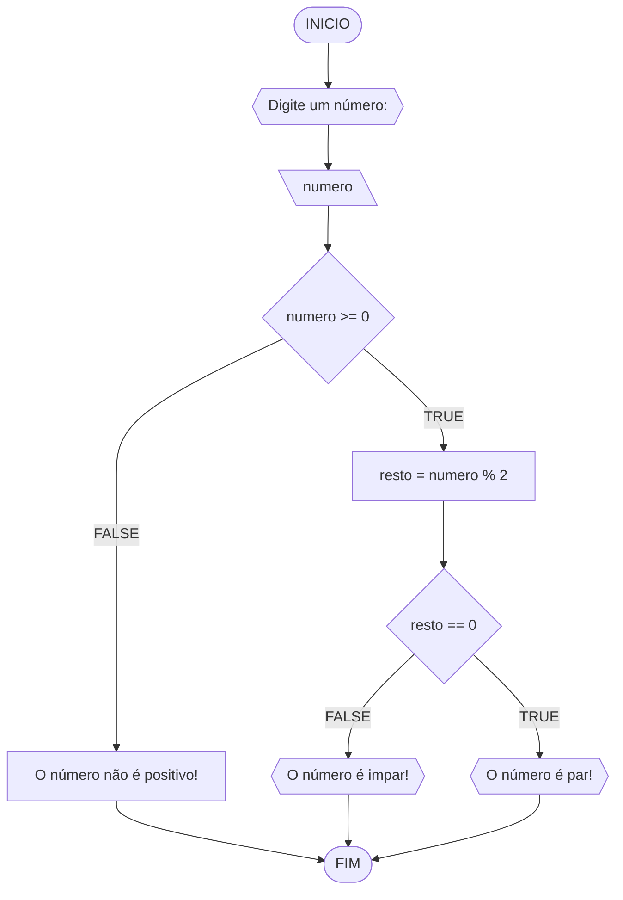
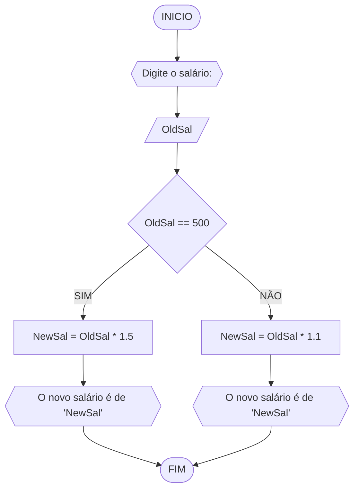
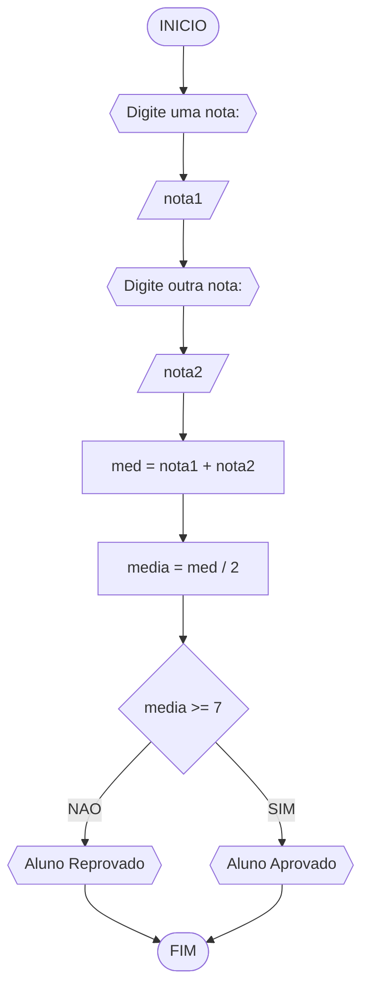
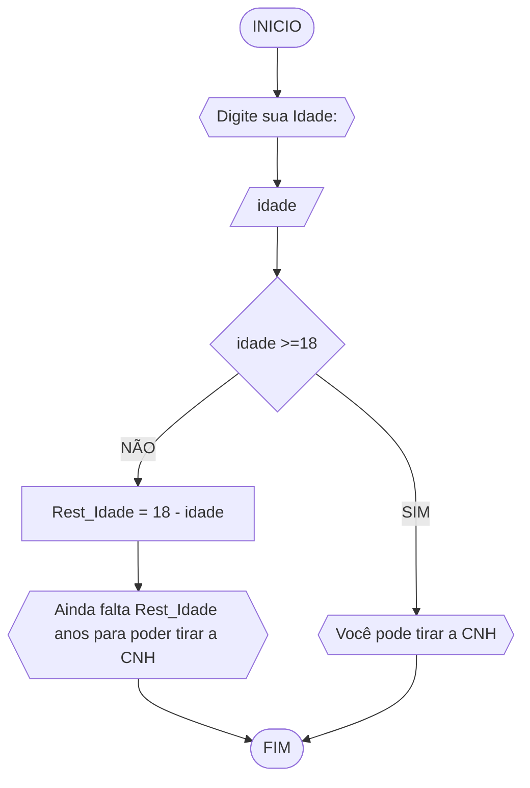

# UNIFOR
**Nome**: Samuel Mesquita Rocha <br>
**Disciplina**: Raciocínio lógico algorítmico

## Lista de exercícios 01

### Exercício 01 (1 ponto)
Represente, em fluxograma e pseudocódigo, um algoritmo para determinar se um número inteiro e positivo é par ou impar.

#### Fluxograma (0,25 ponto)



#### Pseudocódigo (0,5 ponto)
```
1  ALGORITIMO verifica_par_impar
2  DECLARE numero, resto: INTEIRO
3  ESCREVA "Digite um número: "
4  INICIO
4  LEIA numero
5  SE numero >= 0 ENTAO                  // verifica se o inteiro é positivo
6    resto = numero % 2                 // calcula o resto da divisão por 2
7    SE resto == 0 ENTAO                // verifica se o resto é igual a zero
8      ESCREVA "O número é par!"
9    SENAO
10     ESCREVA "O número é impar!"
11   FIM_SE
11  SENAO                                // caso inteiro for negativo (condição linha 5)
12    ESCREVA "O número deve ser postivo!"
13  FIM_SE
13 FIM
```

#### Teste de mesa (0,25 ponto)
| numero | numero >= 0 | resto | resto == 0 | Saída |
| -- | -- | -- | -- | -- | 
| -1 | F |   |   | "O número deve ser postivo!" |
| 0  | V | 0 | V | "O número é par!" |
| 13 | V | 1 | F | "O número é impar!" |
| 30 | V | 0 | V | "O número é par!" |

## Exercício 02 (3 pontos)
Represente, em fluxograma e pseudocódigo, um algoritmo para calcular o novo salário de um funcionário. 
Sabe-se que os funcionários que recebem atualmente salário de até R$ 500 terão aumento de 20%; os demais terão aumento de 10%.

#### Fluxograma (1.0 ponto)



#### Pseudocódigo (1.0 ponto)

```
ALGORITMO New_Salário
Declare OldSal, NewSal: INTEIRO
Escreva "Digite o salário:"
INICIO
Leia OldSal
SE OldSal == 500
  NewSal == OldSal * 1.2
  ESCREVA "O novo salário é NewSal reais"
  SENAO
    NewSal == OldSal * 1.1
    ESCREVA "O novo salário é NewSal reais"
FIM_SE
FIM
  
```

#### Teste de mesa (1.0 ponto)

| OldSal | OldSal == 500 | NewSal | Saida |  
|      --      |      --      |      --      |      --      | 
| 500 | V | 600 |  "O novo salário é de 600 reais"| 
| 1000   | F | 1100 | "O novo salário é de 1100 reais" | 

## Exercício 03 (3 pontos)
Represente, em fluxograma e pseudocódigo, um algoritmo para calcular a média aritmética entre duas notas de um aluno e mostrar sua situação, que pode ser aprovado ou reprovado.

#### Fluxograma (1 ponto)



#### Pseudocódigo (1 ponto)

```
Algoritmo ContaAprovacoes
Declare nota1, nota2, med, media :float
INICIO
ESCREVA "Digite uma nota:"
Leia nota1
ESCREVA "Digite outra nota:"
Leia nota2
med = nota1 + nota2
media = med / 2
SE media >= 7
  ESCREVA "Aluno Aprovado"
  SENAO
    ESCREVA "Aluno Reprovado"
FIM_SE
FIM_ALGORITMO
```

#### Teste de mesa (1 ponto)

| nota1 | nota2 | med | media | media>=7 | Saida|
|      --      |      --      |      --      |      --      |      --      |       --      | 
| 7     | 9       | 16    |  8     | V    |       "Aluno Aprovado"    | 
| 5   | 4          | 9        | 4.5 | F  |         "Aluno Reprovado" | 

## Exercício 04 (3 pontos)
Represente, em fluxograma e pseudocódigo, um algoritmo que, a partir da idade do candidato(a), determinar se pode ou não tirar a CNH. 
Caso não atender a restrição de idade, calcular quantos anos faltam para o candidato estar apto.

#### Fluxograma (1.0 ponto)



#### Pseudocódigo (1.0 ponto)

```
Algoritmo ContaAprovacoes
Declare Idade, Rest_Idade: INTEIRO
ESCREVA "Digite sua idade:"
INICIO
Leia Idade
SE Idade >= 18
  ESCREVA "Você pode tirar a CNH"
  SENAO
    Rest_Idade = 18 - Idade
    ESCREVA "Ainda falta Rest_Idade anos para poder tirar a CNH"
FIM_SE
FIM_ALGORITMO
```

#### Teste de mesa (1.0 ponto)

| idade | idade>= 18 | Rest_Idade | Saída | 
|      --      |      --      |      --      |      --      |  
| 19     | V       |  |  "Você pode tirar a CNH"     | 
| 16   | F          | 2        | "Ainda falta 2 anos para poder tirar a CNH" | 
