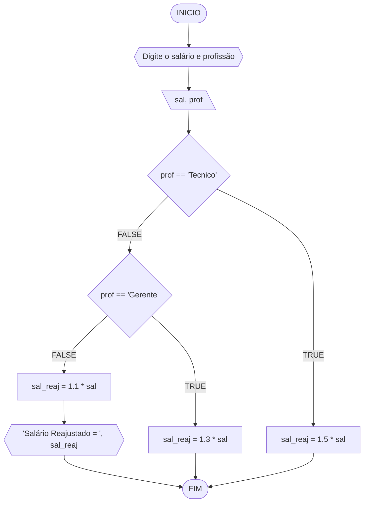
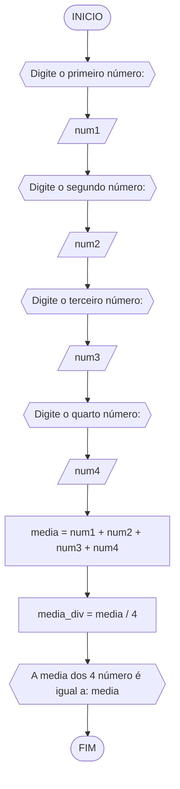
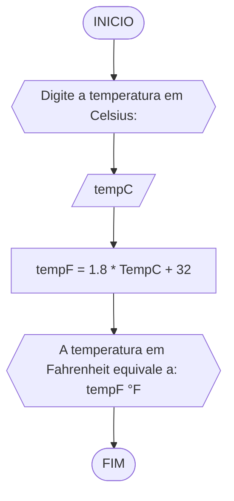
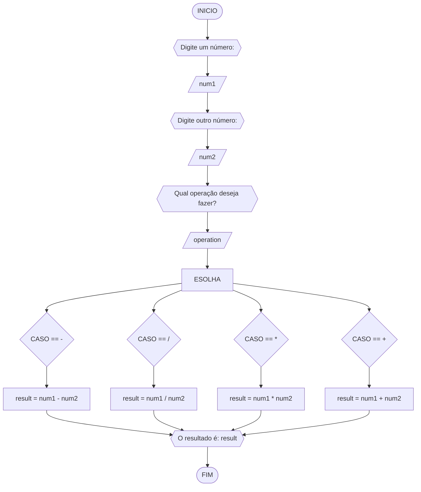
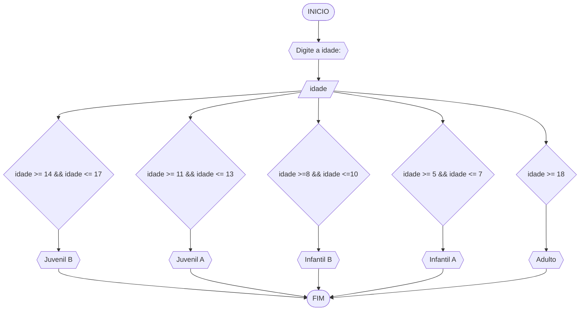

# UNIFOR
**Nome**: Samuel Mesquita Rocha <br>
**Disciplina**: Raciocínio lógico algorítm

## Exercício exemplo
Represente, em fluxograma e pseudocódigo, um algoritmo para calcular o adicional de salário de funcionário por cargo de uma empresa fictícia. Sabe-se que os funcionários de cargo técnico receberão reajuste de 50%, cargo de gerência, um reajuste de 30% e demais, um reajuste de 10%. 

#### Fluxograma


#### Pseudocódigo
```
1  ALGORITMO calReajuste
2  DECLARE  sal, sal_reaj: real, prof: caractere
3  INICIO
4  LEIA sal, prof
5  ESCOLHA
6   CASO prof == “Técnico”		// caso 1
7     sal_reaj ← 1.5 * sal
8   CASO prof = “Gerente”		// caso 2
9     sal_reaj ← 1.3 * sal
10  SENÃO
11    sal_reaj ← 1.1 * sal
12 FIM_ESCOLHA
13 ESCREVA “Salário Reajustado = “, sal_reaj
14 FIM
```

#### Teste
| sal | prof | prof == “Técnico” | prof = “Gerente” | sal_reaj | Saída |
| -- | -- | -- | -- | -- | -- |
| 1000 | Técnico | V | F | 1500 | “Salário Reajustado = 1500“ |
| 2000 | Gerente | F | V | 2600 | “Salário Reajustado = 2600“ |
| 9000 | Diretor | F | F | 9900 | “Salário Reajustado = 9900“ |

## Lista de exercícios 02

### Exercício 01 (2.5 pontos)
Calcule a média de quatro números inteiros dados.

#### Fluxograma (1.0 ponto)



#### Pseudocódigo (1.0 ponto)

```
Algoritmo Media
Declare num1, num2, num3, num4, media: INTEIRO
Declare media_div: float
INICIO
ESCREVA "Digite o primeiro número: "
Leia num1
ESCREVA "Digite o segundo número: "
Leia num2
ESCREVA "Digite o terceiro número: "
Leia num3
ESCREVA "Digite o quarto número:"
media = num1 + num2 + num3 + num4
media_div = media / 4
ESCREVA "A media dos 4 número é igual a: media"
FIM_ALGORITMO
```

#### Teste de mesa (0.5 ponto)

| num1 | num2 | num3 | num4 | media | media_div| Saída|
|      --      |      --      |      --      |      --      |      --      |       --      |       --      | 
| 4     | 5       | 6    |  7     | 22    |    5.5     |       "A media dos 4 números é igual a: 5.5"      | 
| 1   | 2          |3        | 4| 10  |    2.5     |       "A media dos 4 números é igual a: 2.5"      | 

### Exercício 02 (2.5 pontos)
Leia uma temperatura dada em Celsius (C) e imprima o equivalente em Fahrenheit (F). (Fórmula de conversão: F = (9/5) * C + 32)

#### Fluxograma (1.0 ponto)



#### Pseudocódigo (1.0 ponto)

```
Algoritmo ConverteCelsiusFarenheit
Declare tempC, tempF: FLOAT
ESCREVA "Digite a temperatura em Celsius"
INICIO
Leia tempC
tempF = tempF = 1.8 * TempC + 32
ESCREVA "A temperatura em Fahrenheit equivale a: tempF°F"
FIM_ALGORITMO
```

#### Teste de mesa (0.5 ponto)

| tempC | tempF | Saída | 
|      --      |      --      |      --      | 
| 32     | 89.6       | "A temperatura em Fahrenheit equivale a: 89.6°F"    |  
| 100   | 212          | "A temperatura em Fahrenheit equivale a: 212°F"       | 

### Exercício 03 (2.5 pontos)
Receba dois números reais e um operador e efetue a operação correspondente com os valores recebidos (operandos). 
O algoritmo deve retornar o resultado da operação selecionada simulando todas as operações de uma calculadora simples.

#### Fluxograma (1.0 ponto)



#### Pseudocódigo (1.0 ponto)

```
Algoritmo Calculadora
Declare num1, num2 : INTEIRO
Declare result: FLOAT
Declare operation: STRING
INICIO
ESCREVA "Digite um número:"
Leia num1
ESCREVA "Digite outro número:"
Leia num2
ESCREVA "Qual operação deseja fazer?"
Leia operation
ESCOLHA (operation){
  CASO "+":
    result = num1 + num2
    break;
  CASO "-":
    result = num1 - num2
    break;]
  CASO "/":
    result = num1 / num2
    break;
  CAS0 "*":
    result = num1 * num2
    break;
}
ESCREVA "O  resultado é: result" 
FIM_ALGORITMO
```

#### Teste de mesa (0.5 ponto)

| num1 | num2 | operation | ESCOLHA | Saída | 
|      --      |      --      |      --      |      --      |      --      | 
| 12     | 21       | +    |  result = num1 + num2     | "O resultado é: 33"    |
| 10   | 20          | *        | result = num1* num2 | "O resultado é: 200" |

### Exercício 04 (2.5 pontos)
Elaborar um algoritmo que, dada a idade, classifique nas categorias: infantil A (5 - 7 anos), infantil B (8 -10 anos), juvenil A (11 - 13 anos), juvenil B (14 -17 anos) e adulto (maiores que 18 anos).

#### Fluxograma (1.0 ponto)



#### Pseudocódigo (1.0 ponto)

```
Algoritmo ClassificaCategoria
Declare idade: INTEIRO
ESCREVA "Digite a idade:"
INICIO
Leia idade
SE idade >= 5 && idade <= 7
  ESCREVA "Infantil A"
FIM_SE
SE idade >=8 && idade <=10
  ESCREVA "Infantil B"
FIM_SE
SE idade >= 11 && idade <= 13
  ESCREVA "Juvenil A"
FIM_SE
SE idade >= 14 && idade <= 17
  ESCREVA "Juvenil B"
FM_SE
SE idade >= 18
  ESCREVA "Adulto"
FIM_SE
FIM_ALGORITMO
```

#### Teste de mesa (0.5 ponto)

| idade | Saída | 
|      --      |      --      |   
| 12     | "Juvenil A"       | 
| 20   | "Adulto"          | 
