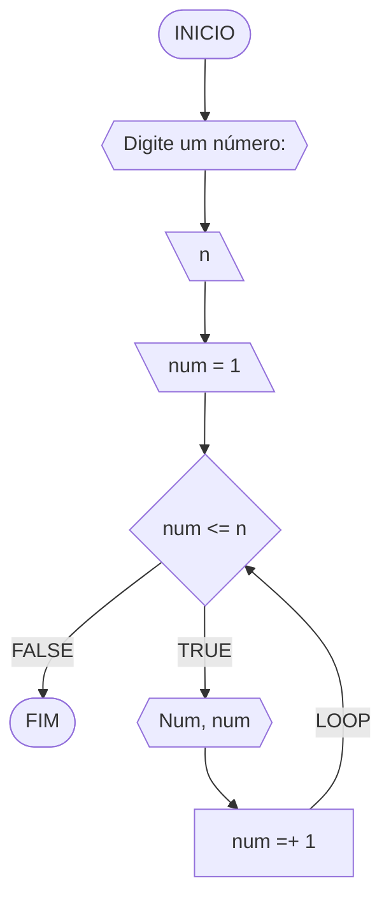
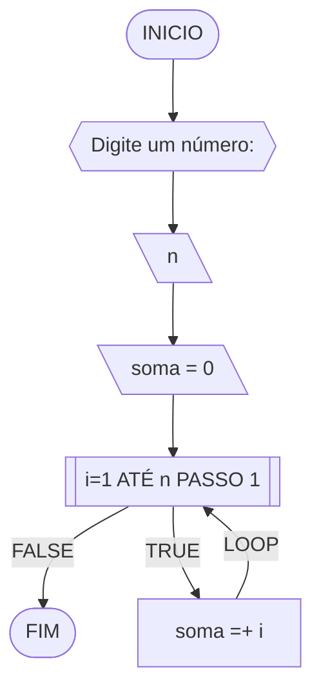
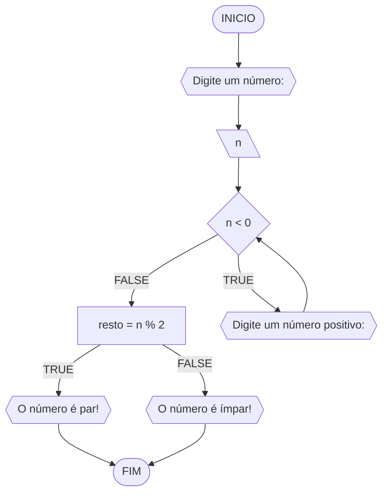
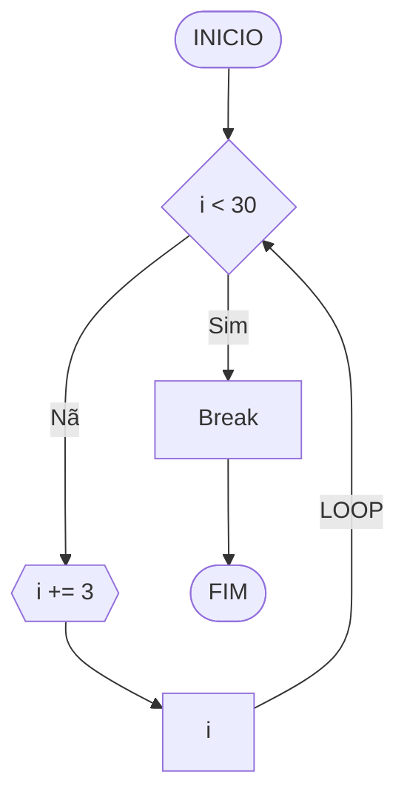
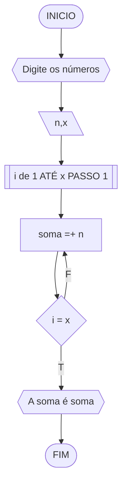
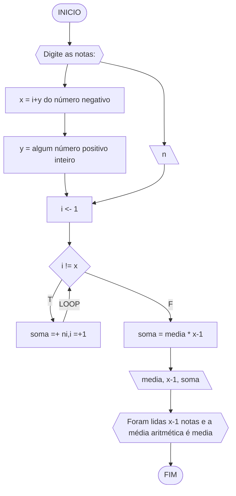

# UNIFOR
**Nome**: Samuel Mesquita Rocha <br>
**Disciplina**: Raciocínio lógico algorítm

## Exercício exemplo 1
Implemente e teste um programa que imprima os n primeiros números.

#### Fluxograma


#### Pseudocódigo
```
1 ALGORITMO print_n_primeiros
2 DECLARE n, num: INTEIRO
3 INICIO
4 ESCREVA “Digite um número: ”
4 LEIA n			// variável de entrada n
4 num ← 1			// variável num inicializada
5 ENQUANTO num <= n FAÇA	// n iterações
7	ESCREVA “Número ”, num
8	num ← num + 1		// num =+ 1 (incremento)
8 FIM_ENQUANTO
9 FIM
```

#### Teste de mesa
| it | n  | num | num <= n | Saída      | num =+ 1 |
| -- | -- | --  | --       | --         | --       |
| 1  | 10 | 1   | True     | Número 1   | 2        |
| 2  | 10 | 2   | True     | Número 2   | 3        |
| 3  | 10 | 3   | True     | Número 3   | 4        |
| 4  | 10 | 4   | True     | Número 4   | 5        |
| 5  | 10 | 5   | True     | Número 5   | 6        |
| 6  | 10 | 6   | True     | Número 6   | 7        |
| 7  | 10 | 7   | True     | Número 7   | 8        |
| 8  | 10 | 8   | True     | Número 8   | 9        |
| 9  | 10 | 9   | True     | Número 9   | 10       |
| 10 | 10 | 11  | True     | Número 10  | 11       |
| 11 | 10 | 11  | False    |            |          |

## Exercício exemplo 2
Implemente e teste um programa que some os n primeiros números.

#### Fluxograma


#### Pseudocódigo
```
1  ALGORITMO	soma_n_numeros()
2  DECLARE	n, i, soma: INTEIRO
3  INICIO
4  ESCREVA “Digite a quantidade de números: ”
5  LEIA n		// variável de entrada n
7  soma ← 0		// variável soma inicializada
6  PARA i DE 1 ATÉ n PASSO 1 FAÇA
7	soma ← soma + i	// soma =+ i (incremento)
8  FIM_PARA
9  ESCREVA “A soma é igual a ”, soma
10 FIM
```

#### Teste de mesa
| it | n  | soma | i  | soma =+ i |
| -- | -- | --   | -- | --        |
| 1  | 10 | 0    | 1  | 1         |
| 2  | 10 | 1    | 2  | 3         |
| 3  | 10 | 3    | 3  | 6         |
| 4  | 10 | 6    | 4  | 10        |
| 5  | 10 | 10   | 5  | 15        |
| 6  | 10 | 15   | 6  | 21        |
| 7  | 10 | 21   | 7  | 28        |
| 8  | 10 | 28   | 8  | 36        |
| 9  | 10 | 36   | 9  | 45        |
| 10 | 10 | 45   | 10 | 55        | 

## Lista de exercícios 03

### Exercício 01 (2.5 pontos)
Atualize o algoritmo para determinar se um número inteiro e positivo é par ou ímpar, usando uma laço condicional para aceitar apenas números maiores ou iguais a zero. 

#### Fluxograma (1.0 ponto)



#### Pseudocódigo (1.0 ponto)

```
Algoritmo ParImpar
DECLARE n, resto: INTEIRO
ESCREVA "Digite um número: "
INICIO
LEIA n
SE n < 0 ENTAO
	ENQUANTO n < 0 FAÇA
		ESCREVA "Digite um número positivo: "
	FIM_ENQUANTO
SE n  % 2 == 0  
  ESCREVA "O número é par"
SE n % 2 != 0
  ESCREVA "O número é impar"
FIM_SE
FIM_ALGORITMO
```

#### Teste de mesa (0.5 ponto)

| n | n < 0 | n % 2 ==0 | n % 2 != 0 | Saída | 
|      --      |      --      |      --      |      --      |      --      | 
| 10     | F       | V    |       | "O número é par"   |
| -1   | V          |        | | "Digite um número positivo:"  |

### Exercício 02 (2.5 pontos)
Faça um algoritmo que exiba na tela uma contagem de 0 até 30, exibindo apenas os múltiplos de 3.

#### Fluxograma (1.0 ponto)



#### Pseudocódigo (1.0 ponto)

```
Algoritmo ClassificaCategoria
Declare i = 0 :inteiro
INICIO
SE i < 30
  i += 3
 ESCREVA "i"
FIM_SE
FIM_ALGORITMO
```

#### Teste de mesa (0.5 ponto)

| i | Saída | 
|      --      |      --      | 
| 3     | "6"       |
| 30   |           |

### Exercício 03 (2.5 pontos)
Dada uma sequência de números inteiros, calcular a sua soma. 
Por exemplo, para a sequência {12, 17, 4, -6, 8, 0}, o seu programa deve escrever o número 35.

#### Fluxograma (1.0 ponto)



#### Pseudocódigo (1.0 ponto)

```
1 ALGORITMO Soma_os_números
2 DECLARE n,i,x,soma:INTEIRO
3 ESCREVA "Digite os números"
4 INICIO
5 LEIA [\n,x\] // n são os números e x é a quantidade de números.
6 PARA i DE 1 ATÉ x PASSO 1 FAÇA 
9 soma ← soma + n
10 FIM_PARA
11 LEIA soma
12 ESCREVA "A soma é soma"
13 FIM_ALGORITMO
```

#### Teste de mesa (0.5 ponto)

| iteração | i | saída | n |  x |
|      --      |      --      |      --      |      --      |   -- |   
|      0      |      1      |      A soma é 0      |          12, 17, 4, -6, 8, 0 | 6  |
|      1      |      1      |      A soma é 12      |                 17,4,-6,8,0       | 6 |
|      2      |      2      |      A soma é 29     |              4,-6,8,0         | 6 | 
|      3      |      3      |      A soma é 33     |                -6,8,0      | 6 |
|      4      |      4      |      A soma é  27    |              8,0        |  6 | 
|      5      |      5      |      A soma é  35    |                 0        | 6 |
| 6 | 6 | A soma é  35 | | 6 |

### Exercício 04 (2.5 pontos)
Escreva um programa que leia a nota de diversos alunos, até que seja digitada uma nota negativa. 
Nesse momento, ele mostra a média aritmética de todas as notas lidas e quantas notas foram lidas. 
Ex. Foram lidas 14 notas. A média aritmética é 6.75!

#### Fluxograma (1.0 ponto)



#### Pseudocódigo (1.0 ponto)

```
ALGORITMO ClassificaCategoria
DECLARE x,i,y:INTEIROS media, soma, n:REAL
ESCREVA"Digite as notas"
INICIO
LEIA n // as notas
 x = i + y do n negativo
 y c Inteiros
 i <- 1
ENQUANTO i != x  FAÇA
soma =+ni e i=+1
FIM_ENQUANTO
SE i = x ENTÃO
soma - nx = media*(x-1)
FIM_SE
LEIA media,soma,x-1
ESCREVA Foram lidas x-1 notas e a média aritmética é media
FIM
```

#### Teste de mesa (0.5 ponto)

| notas | média | x |  soma | nx | saída |
|      --      |      --      |      --      |      --      |      --      |  -- |
| 10, 9,8,7.5, -30   |   8.625     | 5    |  4.5     | -30    | Foram lidas 4 notas e a média aritmética foi 8.625|
| 10, 8, 7 ,4,5,-2   |    6.75       | 6        | 32  | -2 | Foram lidas 5 notas e a média aritmética foi 8.625|   
